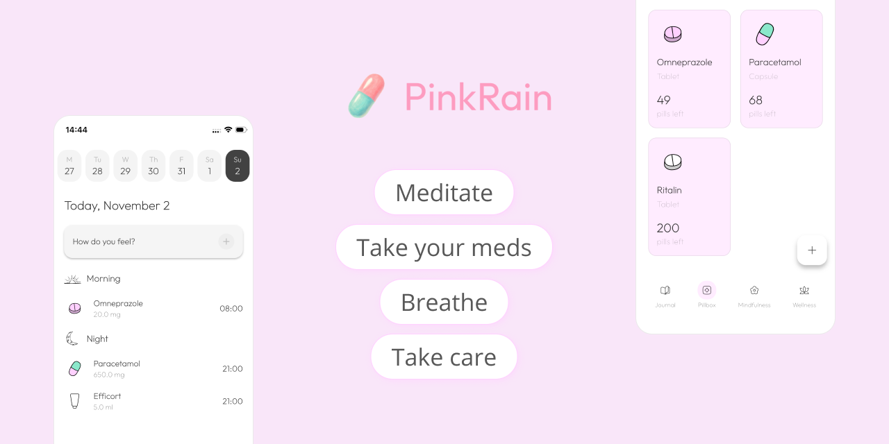
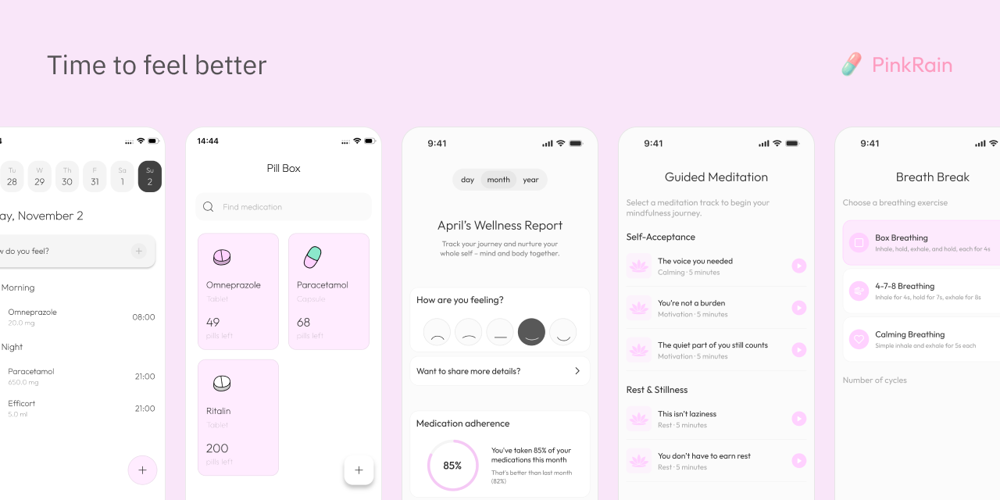

# PinkRain, a gentle health journal 🌸

<div align="center">
  
  
  [](https://flutter.dev)
  [](https://dart.dev)
  [](LICENSE)
  []()
  []()

  **A privacy-first mental health companion that helps you track your wellness journey, manage medications, and find emotional support.**
  
  *Your data stays on your device. Always.*

</div>

<div align="center">
  
  <br/><br/>
  
</div>

## About PinkRain

PinkRain is a comprehensive mental health and wellness tracking application designed with privacy at its core. Unlike other health apps, **all your data remains securely stored on your device** and never leaves your phone. The app provides mood tracking, medication management, wellness analytics, breathing exercises, and guided meditation to support your mental wellness journey.

**🧪 Experimental AI Feature**: PinkRain also includes an optional experimental AI-powered symptom prediction feature that can be enabled during development or testing. This feature is **disabled by default** in the main app build, ensuring the standard version focuses on core wellness tracking without AI dependencies.

> **❗ IMPORTANT DISCLAIMER**: This is an experimental research project made open source for educational and development purposes. This app is **NOT a medical device** and does not claim to improve your mental or physical health in any way. It should **NEVER be considered a replacement for professional healthcare providers**, licensed therapists, psychiatrists, or medical professionals. Consult qualified healthcare providers for medical advice, diagnosis, or treatment.


### Why PinkRain?

- **Privacy First**: Zero data collection - everything stays on your device
- **Medication Tracking**: Never miss a dose with smart notifications and reminders
- **Wellness Insights**: Beautiful charts, correlation analysis, and PDF reports
- **Mood Tracking**: Daily journaling and mood logging with visual trends
- **Emotional Support**: Curated healing audio tracks and guided meditation
- **Mindfulness Tools**: Breathing exercises and mindfulness practices
- **Cross-Platform**: Built with Flutter for iOS and Android
- **Experimental AI** (Optional): AI-powered symptom prediction available as an experimental build option

## Features

### 📝 **Journal & Mood Tracking**
- Daily mood logging with rich descriptions
- Correlation analysis between mood, symptoms, and medications
- Beautiful visualizations and trends

### 💊 **Smart Medication Management** 
- Comprehensive medication database with custom dosages
- Smart notification system with snooze and mark-taken actions
- Adherence tracking and reports
- Visual pill identification

### 🎵 **Guided Meditation & Audio Support**
- Curated healing audio tracks:
  - "The Voice You Needed"
  - "You're Not a Burden"
  - "What You Feel is Real"
  - "When You Miss Who You Used to Be"
  - And more...
- Breathing exercises with visual guidance
- Mindfulness sessions

### 📊 **Wellness Analytics**
- Interactive charts showing mood patterns
- Medication adherence statistics
- Symptom correlation analysis
- PDF report generation for healthcare providers
- Data export functionality


### 🔔 **Smart Notifications**
- Medication reminders with action buttons
- Daily mood check-ins
- Wellness insights notifications
- Customizable notification sounds

## Getting Started

### Prerequisites

- Flutter 3.3.4 or higher
- Dart 3.0 or higher
- Android Studio / VS Code
- Git

### Installation

1. **Clone the repository**
   ```bash
   git clone https://github.com/rudi-q/pinkrain_health_journal.git
   cd pinkrain_health_journal
   ```

2. **Install dependencies**
   ```bash
   flutter pub get
   ```

3. **Run the app**
   ```bash
   flutter run
   ```

### 🧪 Experimental AI Feature (Optional)

PinkRain includes an **experimental** AI-powered symptom prediction feature using TensorFlow Lite. **This feature is NOT enabled by default** in the main app. The standard PinkRain app works fully without any AI functionality, focusing on core wellness tracking features.

#### Main App (Default - No AI)

The standard PinkRain app includes all core features without AI:
- ✅ Mood tracking and journaling
- ✅ Medication management and reminders
- ✅ Wellness analytics and charts
- ✅ Breathing exercises and meditation
- ✅ All privacy-first features
- ❌ AI symptom prediction (not included)

**Run standard app:**

```bash
# Development
flutter run

# Release builds (no AI)
flutter build apk --release
flutter build appbundle --release
flutter build ios --release
```

#### Experimental Version (With AI)

If you want to try the experimental AI symptom prediction feature, you can build PinkRain with AI enabled:

**Enable Experimental AI Symptom Prediction:**
```bash
# Development
flutter run --dart-define=EXPERIMENTAL=true

# Release builds with AI
flutter build apk --release --dart-define=EXPERIMENTAL=true
flutter build appbundle --release --dart-define=EXPERIMENTAL=true
flutter build ios --release --dart-define=EXPERIMENTAL=true
```

> **Important Notes**:
> - The experimental AI feature adds ~12MB to the app size (TensorFlow Lite models)
> - When experimental mode is disabled (default), the app functions normally without any AI features
> - The TensorFlow Lite model files may still be included in the bundle but are not loaded into memory when AI is disabled
> - **Web Platform**: Experimental AI features are automatically disabled on web platforms regardless of the `EXPERIMENTAL` flag, as TensorFlow Lite is not supported in web browsers
> - The AI feature is experimental and should not be relied upon for medical decisions

## Architecture

PinkRain follows clean architecture principles with clear separation of concerns:

```
lib/
├── core/
│   ├── models/          # Data models
│   ├── services/        # Core services (Hive, Navigation)
│   ├── theme/          # App theming
│   ├── util/           # Utilities and helpers
│   └── widgets/        # Reusable widgets
├── features/
│   ├── journal/        # Mood tracking and journaling
│   ├── pillbox/        # Medication management
│   ├── wellness/       # Analytics and insights
│   ├── breathing/      # Breathing exercises
│   ├── meditation/     # Guided meditation
│   └── profile/        # User settings
└── main.dart
```

### Key Technologies

- **State Management**: Riverpod
- **Local Database**: Hive (NoSQL)
- **AI/ML**: TensorFlow Lite (experimental feature only)
- **Charts**: FL Chart
- **Audio**: Just Audio
- **Notifications**: Flutter Local Notifications
- **PDF Generation**: PDF package
- **Navigation**: Go Router

## 🧪 Testing

PinkRain includes comprehensive testing:

```bash
# Run all tests
flutter test

# Run integration tests
flutter drive --target=integration_test/app_test.dart

# Run specific test files
flutter test test/features/journal/
```

### Test Coverage
- Unit tests for business logic
- Widget tests for UI components
- Integration tests for user flows
- Notification action testing

## 🤝 Contributing

We welcome contributions from the community! Whether you're fixing bugs, adding features, or improving documentation, your help is appreciated.

### How to Contribute

1. **Fork the repository**
2. **Create a feature branch**
   ```bash
   git checkout -b feature/amazing-feature
   ```
3. **Make your changes**
4. **Add tests** for new functionality
5. **Run tests** and ensure they pass
   ```bash
   flutter test
   ```
6. **Commit your changes**
   ```bash
   git commit -m "Add amazing feature"
   ```
7. **Push to your branch**
   ```bash
   git push origin feature/amazing-feature
   ```
8. **Open a Pull Request**

### Development Guidelines

- Follow [Flutter style guide](https://dart.dev/guides/language/effective-dart/style)
- Write tests for new features
- Update documentation as needed
- Ensure privacy-first principles are maintained

### Areas We Need Help

- 🌐 **Internationalization**: Help translate the app
- 🎨 **UI/UX**: Improve accessibility and user experience
- 🧪 **Testing**: Add more test coverage
- 📚 **Documentation**: Improve guides and tutorials
- 🤖 **AI/ML**: Enhance symptom prediction models

## 🛡️ Privacy & Security

### Privacy First Design
- **No data collection**: All data remains on your device
- **No analytics tracking**: We don't track user behavior
- **No cloud sync**: Data never leaves your device
- **Open source**: Full transparency in code

### Security Features
- Local encryption for sensitive data
- Secure local notifications
- No network requests for personal data
- Privacy-focused third-party dependencies

## ❗ Medical Disclaimer & Research Notice

### 🔬 **Experimental Research Project**
This application is an **experimental research project** developed for educational, research, and open-source development purposes. It is made available to the community to advance understanding of mental health tracking technologies and privacy-preserving app development.

### 🏥 **Not a Medical Device or Healthcare Service**
**IMPORTANT:** This app is **NOT**:
- A medical device or diagnostic tool
- A substitute for professional medical advice, diagnosis, or treatment
- Intended to cure, treat, prevent, or diagnose any medical condition
- A replacement for therapy, counseling, or psychiatric care
- Clinically validated or FDA-approved

### 👩‍⚕️ **Professional Healthcare Advisory**
**ALWAYS consult with qualified healthcare professionals** including but not limited to:
- Licensed physicians and psychiatrists
- Licensed therapists and counselors
- Certified mental health professionals
- Your primary care provider

**Before making any decisions about your mental health, medication, or treatment based on information from this app.**

### ⚠️ **Emergency Situations**
If you are experiencing a mental health emergency or crisis:
- **Call emergency services immediately (911, 988 Suicide & Crisis Lifeline)**
- **Contact your local crisis intervention center**
- **Go to your nearest emergency room**
- **This app cannot and should not be used for emergency situations**

### **Limitation of Liability**
By using this experimental research application, you acknowledge that:
- The developers, contributors, and maintainers assume no responsibility for any health outcomes
- All data and insights provided are for informational and research purposes only
- You use this application at your own risk
- Any decisions regarding your health should be made in consultation with qualified healthcare providers

### **Research and Data Use**
This is a research project designed to:
- Explore privacy-preserving mental health tracking technologies
- Demonstrate on-device AI/ML capabilities
- Advance open-source mental health tools development
- **All your data remains on your device and is never transmitted or collected**

## License

This project is licensed under the MIT License - see the [LICENSE](LICENSE) file for details.

**Additional Terms:** By using this software, you acknowledge that you have read and understood the Medical Disclaimer above and agree to use this experimental research application in accordance with these terms.

## Acknowledgments 💛

- **Flutter Team** for the amazing framework
- **TensorFlow Lite** for on-device ML capabilities (experimental AI features)
- **Hive** for fast local storage
- **All contributors** who help make PinkRain better
- **Mental health advocates** who inspire this work

## Support

Need help or have questions?

- 📧 **Email**: [reach@rudi.engineer](mailto:reach@rudi.engineer)
- 🐛 **Bug Reports**: [GitHub Issues](https://github.com/rudi-q/pinkrain_health_journal/issues)
- 💬 **Discussions**: [GitHub Discussions](https://github.com/rudi-q/pinkrain_health_journal/discussions)

## Roadmap

- [ ] **Multi-language support**
- [ ] **Accessibility improvements**
- [ ] **Dark Mode support**
- [ ] **Advanced analytics**

<div align="center">
  ### "Your mental health matters. Your privacy too" 🕊️
  
  **Made with 🩷 for mental health awareness**
  
  ⭐ **Star this repo if you found it helpful!** ⭐
</div>
